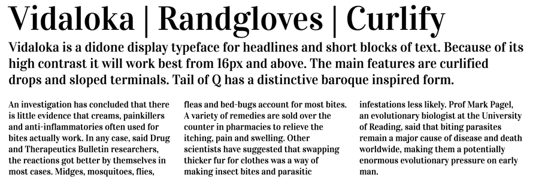

Vidaloka is a didone display typeface for headlines and 
short blocks of text. Because of its high contrast it will
work best from 16px and above.

The main features are curlified drops and sloped terminals. 
Tail of Q has a distinctive baroque inspired form.

Vidaloka is designed by Alexei Vanyashin and Olga Karpushina.

Vidaloka is a Unicode typeface family that supports 
languages that use the Latin script and its variants, and 
could be expanded to support other scripts.

